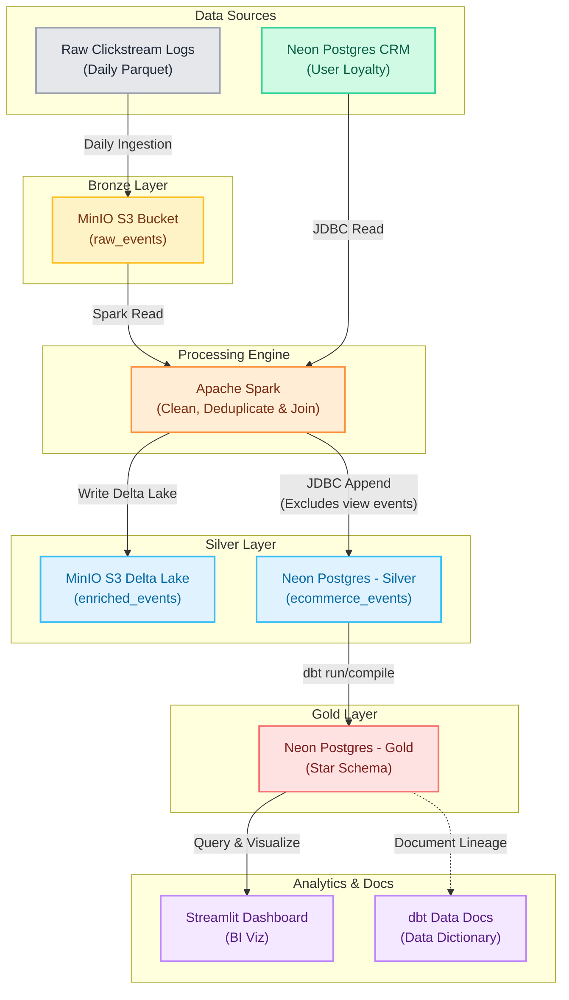

# 🛒 E-Commerce Medallion Pipeline

## 📌 Project Overview

An enterprise-grade **Hybrid Cloud Data Engineering pipeline** built on the Medallion Architecture. This pipeline ingests massive raw e-commerce clickstream events, processes and enriches them through Bronze → Silver → Gold layers, utilizes **Delta Lake** on S3-compatible storage (**MinIO**), connects with **Neon Postgres Cloud** for CRM database integration, orchestrates daily incremental runs with **Apache Airflow 3**, builds a star schema via **dbt Core**, and visualizes business KPIs using a **Streamlit** dashboard.

**Business Goal:** Transform raw clickstream behavioral logs (views, cart additions, purchases) and join them with Customer Relationship Management (CRM) databases to enable advanced business intelligence on sales performance, customer loyalty tiers, and shopping cart abandonment.

---

## 🏗️ Architecture & Tech Stack



* **Orchestration:** 
* **Batch Processing:** 
* **Storage Layer (Lakehouse):**  + 
* **Cloud Warehouse:** 
* **Transformation & Quality:** 
* **Visualization:** 
* **Containerization:** 

---

## 📁 Project Structure

```
ecommerce-medallion-pipeline/
│
├── dags/
│   └── dag.py                         # Airflow 3 DAG (Incremental execution by date)
│
├── scripts/                           # Execution scripts (Python and PySpark)
│   ├── utils/                         # Centralized shared utility modules
│   │   ├── __init__.py
│   │   ├── config.py                  # centralized env loading & paths validation
│   │   ├── logger.py                  # console and rotating file logging setup
│   │   ├── db.py                      # psycopg2 context manager & JDBC credentials config
│   │   └── spark.py                   # pre-configured PySpark session generator
│   │
│   ├── raw_to_bronze_prep.py          # PySpark job to partition raw CSV events locally
│   ├── bootstrap_crm_database.py      # Samples & seeds CRM users to Neon Postgres (dynamic checking)
│   ├── upload_to_bronze.py            # Helper to upload daily staging file to MinIO Bronze
│   ├── bronze_to_silver.py            # PySpark: Reads Bronze S3, joins CRM JDBC, writes Silver Delta
│   ├── silver_to_rdbms.py             # PySpark: Filters views, deletes old date, appends to Neon JDBC
│   └── app.py                         # Streamlit dashboard querying Neon Postgres Gold
│
├── dbt/                               # Root dbt project
│   ├── models/gold/
│   │   ├── dim_users.sql              # Active user session aggregates
│   │   ├── dim_products.sql           # Unique product categories & brands (deduplicated)
│   │   ├── dim_users_loyalty.sql      # User dimension joined with Neon CRM VIP tiers & channels
│   │   ├── fact_cart_abandonment.sql  # session-level abandoned products (no purchase)
│   │   ├── fact_sales.sql             # deduplicated purchase transaction records
│   │   └── schema.yml                 # 16 schema constraints & data quality tests
│   ├── dbt_project.yml
│   └── profiles.yml                   # Neon Postgres connection over SSL
│
├── data/
│   ├── landing/                       # Landing zone for raw clickstream gzip files
│   └── staging/                       # Staging zone for daily partitioned Snappy Parquet files
│
├── dockerfile                         # Custom Airflow image (adds JRE, Spark 4.0, dbt & Python packages)
├── docker-compose.yml                 # Airflow V3 stack, MinIO S3 & MC Client
├── requirements.txt                   # Image python packages (pyspark, delta-spark, dbt, psycopg2)
└── .env                               # Environment configurations (MinIO & Neon credentials)
```

---

## ⚙️ Pipeline Workflow

### 1. Raw Splitting & CRM Seeding (One-time Setup)
* **Clickstream Splitting:** Raw multi-gigabyte clickstream gzips are processed via PySpark and partitioned into Snappy-compressed daily Parquet files under `data/staging/` (takes ~3m 20s for 100M events).
* **CRM Database Seeding:** Scans unique users across clickstream, automatically checks the database storage capacity via SQL (assuming a 512MB limit for Neon Free Tier, or querying the Neon API if API credentials are provided), dynamically downsamples the user base to fit safely within the remaining storage (with a 50MB safety buffer), and seeds them over JDBC into `crm.user_loyalty` on Neon Postgres.

### 2. Daily Ingestion (Airflow Scheduler)
* **Bronze Ingestion:** Uploads the target run date's Parquet file (`{{ ds }}`) from `staging` to MinIO `ecommerce-bronze` bucket.
* **Bronze → Silver Delta (Spark):** 
  * Reads clickstream from S3 Bronze.
  * Connects to Neon Postgres CRM via JDBC to pull user loyalty tiers and acquisition channels.
  * Left-joins clickstream with user loyalty data.
  * Writes the enriched stream to MinIO `ecommerce-silver/ecommerce_events` in **Delta Lake** format.
* **Silver → Neon RDBMS (Spark JDBC):**
  * Reads the enriched Silver Delta Lake.
  * Filters out volume-heavy `view` events (~90% of data) to preserve space on Neon.
  * Performs an idempotent pre-delete on Neon Postgres for the run date.
  * Bulk-appends the `cart` and `purchase` events to Neon Postgres `silver.ecommerce_events` via JDBC.

### 3. Gold Layer Star Schema (dbt Core)
* Rebuilds the Gold dimension and fact tables on Neon Postgres from the loaded Silver table.
* Enforces deduplication using window functions (`ROW_NUMBER() OVER`) to handle duplicate event clicks.
* Runs **16 data quality tests** to guarantee uniqueness, non-nullability, and referential integrity of surrogate keys.

### 4. Interactive Visualization (Streamlit)
* Streamlit connects to Neon Postgres and queries the Gold layer star schema.
* Displays Total Revenue, Active Customers, Items Sold, and Cart Abandonment Rate.
* Visualizes loyalty distributions, acquisition channel splits, and top-selling brands.

### 5. Automated Data Documentation (dbt Docs)
* Runs `dbt docs generate` at the end of the Airflow DAG to compile schema definitions.
* Automatically hosts the interactive lineage graph and data dictionary web application.

---

## 🚀 Key Engineering Highlights

* **Lakehouse Architecture:** Blends MinIO S3 Object Storage with Delta Lake tables for cheap, scalable raw storage.
* **Neon Cloud Database Optimization:** Restricts RDBMS loads to `cart` and `purchase` events, reducing the storage footprint on Neon by 90%.
* **Hadoop S3A Integration:** Runs on Spark 4.0.1 and Hadoop 3.4.1. Avoids connection timeout parse bugs by explicitly configuring S3A client parameters in milliseconds.
* **Data Quality Deduplication:** Leverages window functions in dbt Gold models to ensure surrogate keys (`sale_id`, `abandonment_id`) pass strict uniqueness tests despite clickstream tracking duplication.
* **Resource Constraint Tuning:** Configures strict Docker container `mem_limit` constraints to optimize memory usage and ensure stable container operation.

---

## 🛠️ How to Run

### 1. Clone and Configure

```bash
git clone <your-repo-url>
cd ecommerce-medallion-pipeline
cp .env.example .env
# Fill out the .env file with your Neon Postgres cloud host/credentials
```

### 2. Prepare Data

Create a Python virtual environment, install the required dependencies, place your raw clickstream `.csv.gz` files under `data/landing/`, and run the preparation scripts:

```bash
# Create and activate a virtual environment
python3 -m venv venv
source venv/bin/activate  # On Windows use: venv\Scripts\activate

# Install required dependencies
pip install -r requirements.txt

# 1. Split raw clickstream into daily Parquet logs
python scripts/raw_to_bronze_prep.py

# 2. Sample and seed Neon Postgres CRM
python scripts/bootstrap_crm_database.py
```

### 3. Start the Stack

```bash
docker compose up -d
```

This starts:
* **`minio` & `minio-mc`:** Boots MinIO at `http://localhost:9001` and initializes `ecommerce-bronze` / `ecommerce-silver` buckets.
* **`postgres-airflow`:** Airflow's metadata backend database.
* **`airflow-init`:** Migrates the Airflow database schema.
* **`airflow-api-server`** / **`airflow-dag-processor`** / **`airflow-scheduler`**: Airflow 3 runtime.
* **`dbt-docs`:** Serves the generated data dictionary and interactive lineage graph at `http://localhost:8081`.

### 4. Login to Airflow

Airflow 3 uses `SimpleAuthManager` which auto-generates a secure password at start. Retrieve the credentials from the console logs:

```bash
docker logs airflow-api-server 2>&1 | grep -i password
# Log in at http://localhost:8080 using username 'admin' and the printed password
```

### 5. Trigger the DAG

You can trigger the pipeline's first execution using either the **Command Line Interface (CLI)** or the **Airflow Web UI**.

#### Option A: Via Command Line (Fastest)
Run the following command directly on your host machine to trigger the DAG for the test day `2020-01-01` (specifying the timezone offset to ensure the logical date aligns with the dataset start date):

```bash
docker exec -it airflow-scheduler airflow dags trigger --logical-date "2020-01-01T08:00:00+07:00" ecommerce_medallion_pipeline
```

#### Option B: Via Airflow Web UI
1. Open **http://localhost:8080** and log in (username: `admin`, password retrieved in Step 4).
2. Click **Trigger** (top right) -> **Trigger DAG w/ config** on the `ecommerce_medallion_pipeline` DAG.
3. Set the **Logical Date** to **`2020-01-01 08:00:00`** (ensuring the UTC execution date matches `2020-01-01` and is at or after the DAG's start date).
4. Click **Trigger** and monitor the task execution graph.

### 6. Start the Dashboard

Launch the Streamlit dashboard locally:

```bash
streamlit run scripts/app.py
```
View the interactive charts at **http://localhost:8501**.

### 7. View Data Documentation

Explore database schemas, data quality test statuses, and visual lineage graph:
* Navigate to **http://localhost:8081** (pages will render fully after the first successful pipeline execution).
