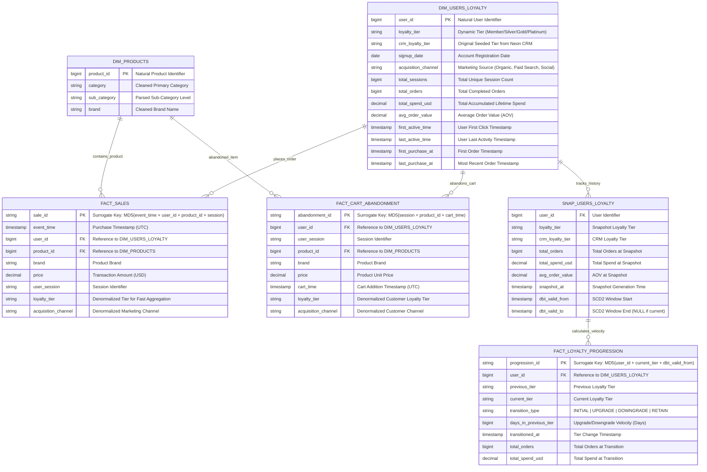

# E-Commerce Medallion Pipeline

A **Data Engineering & Analytics Pipeline** built on the Medallion Architecture. This pipeline ingests e-commerce clickstream behavioral events, processes and enriches them through Bronze → Silver → Gold layers, utilizes **Delta Lake** on S3-compatible object storage (**MinIO**), connects with **Neon Postgres** for CRM database integration, materializes a **DuckDB Data Warehouse**, orchestrates daily incremental runs with **Apache Airflow 3**, builds a Kimball star schema with data quality gates via **dbt Core (`dbt-duckdb`)**, and serves analytics using **Metabase**.

**Business Goal:** Ingest and transform raw clickstream logs (product views, cart additions, purchases) and enrich them with Customer Relationship Management (CRM) data to analyze sales performance, shopping cart abandonment funnels, dynamic RFM customer loyalty tiers, and SCD Type 2 tier progression velocity.

---

## Architecture & Tech Stack

```mermaid
flowchart TD
    subgraph Sources [Data Sources]
        clickstream["Raw Clickstream Logs<br/>(Daily Parquet)"]:::source
        crm_db["Neon Postgres CRM<br/>(User Loyalty)"]:::crm
    end

    subgraph Bronze [Bronze Layer]
        bronze_s3["MinIO S3 Bucket<br/>(ecommerce-bronze)"]:::bronze
    end

    subgraph Spark [Processing Engine]
        spark_job["Apache Spark 4.0<br/>(Clean, Quarantine, Enrich & Join)"]:::spark
        quarantine["MinIO S3 Quarantine<br/>(Malformed Records)"]:::quarantine
    end

    subgraph Silver [Silver Layer]
        silver_s3["MinIO S3 Delta Lake<br/>(ecommerce-silver)"]:::silver
    end

    subgraph DW [Data Warehouse]
        duckdb["DuckDB OLAP DW<br/>(Silver & CRM Tables)"]:::duckdb
        dbt["dbt-duckdb Core<br/>(Topological Build & 32 Tests)"]:::gold
    end

    subgraph Viz [Analytics & Docs]
        metabase["Metabase BI Platform<br/>(Dashboards)"]:::viz
        dbt_docs["dbt Data Docs<br/>(Lineage & Data Dictionary)"]:::viz
    end

    %% Flow lines
    clickstream -->|Daily Ingestion| bronze_s3
    bronze_s3 -->|Spark Read| spark_job
    crm_db -.->|JDBC Read| spark_job
    spark_job -->|Route Invalid Rows| quarantine
    spark_job -->|ACID Delta MERGE| silver_s3

    silver_s3 -->|delta_scan() Extension| duckdb
    crm_db -.->|psycopg2 Sync| duckdb

    dbt -->|Transform & Snapshot| duckdb
    duckdb -->|Query Gold Schema| metabase
    dbt -.->|Document Lineage| dbt_docs

    %% Style Classes
    classDef source fill:#E5E7EB,stroke:#9CA3AF,color:#1F2937,stroke-width:2px;
    classDef crm fill:#D1FAE5,stroke:#34D399,color:#065F46,stroke-width:2px;
    classDef bronze fill:#FEF3C7,stroke:#FBBF24,color:#78350F,stroke-width:2px;
    classDef spark fill:#FFEDD5,stroke:#FB923C,color:#7C2D12,stroke-width:2px;
    classDef quarantine fill:#FEE2E2,stroke:#EF4444,color:#991B1B,stroke-width:2px;
    classDef silver fill:#E0F2FE,stroke:#38BDF8,color:#0369A1,stroke-width:2px;
    classDef duckdb fill:#FFFBEB,stroke:#F59E0B,color:#92400E,stroke-width:2px;
    classDef gold fill:#FEE2E2,stroke:#F87171,color:#7F1D1D,stroke-width:2px;
    classDef viz fill:#F3E8FF,stroke:#C084FC,color:#581C87,stroke-width:2px;
```

* **Orchestration:**  (LocalExecutor, TaskFlow API, Standalone DAG Processor)
* **Distributed Processing:**  (Partition tuning, Delta merge, JDBC connector)
* **Storage Layer (Lakehouse):**  + 
* **Cloud CRM Database:** 
* **Analytical Data Warehouse:**  (Columnar vectorized engine, `delta_scan` support)
* **Data Transformation & Testing:**  (`dbt-duckdb` adapter)
* **Business Intelligence & Dashboards:**  (Self-service KPI cards & conversion funnels)
* **Configuration & Validation:**  (`pydantic-settings` singleton)
* **Unit Testing:**  (In-memory DuckDB test harness)
* **Containerization:** 

---

## Data Modeling & Kimball Star Schema

The Gold Layer is designed following **Kimball Dimensional Modeling** principles to support OLAP queries, business KPI reporting, and customer segmentation.


```mermaid
erDiagram
    DIM_USERS_LOYALTY ||--o{ FACT_SALES : "places_order"
    DIM_PRODUCTS ||--o{ FACT_SALES : "contains_product"
    DIM_USERS_LOYALTY ||--o{ FACT_CART_ABANDONMENT : "abandons_cart"
    DIM_PRODUCTS ||--o{ FACT_CART_ABANDONMENT : "abandoned_item"
    DIM_USERS_LOYALTY ||--o{ SNAP_USERS_LOYALTY : "tracks_history"
    SNAP_USERS_LOYALTY ||--o{ FACT_LOYALTY_PROGRESSION : "calculates_velocity"

    DIM_USERS_LOYALTY {
        bigint user_id PK "Natural User Identifier"
        string loyalty_tier "Dynamic Tier (Member/Silver/Gold/Platinum)"
        string crm_loyalty_tier "Original Seeded Tier from Neon CRM"
        date signup_date "Account Registration Date"
        string acquisition_channel "Marketing Source (Organic, Paid Search, Social)"
        bigint total_sessions "Total Unique Session Count"
        bigint total_orders "Total Completed Orders"
        decimal total_spend_usd "Total Accumulated Lifetime Spend"
        decimal avg_order_value "Average Order Value (AOV)"
        timestamp first_active_time "User First Click Timestamp"
        timestamp last_active_time "User Last Activity Timestamp"
        timestamp first_purchase_at "First Order Timestamp"
        timestamp last_purchase_at "Most Recent Order Timestamp"
    }

    DIM_PRODUCTS {
        bigint product_id PK "Natural Product Identifier"
        string category "Cleaned Primary Category"
        string sub_category "Parsed Sub-Category Level"
        string brand "Cleaned Brand Name"
    }

    FACT_SALES {
        string sale_id PK "Surrogate Key: MD5(event_time + user_id + product_id + session)"
        timestamp event_time "Purchase Timestamp (UTC)"
        bigint user_id FK "Reference to DIM_USERS_LOYALTY"
        bigint product_id FK "Reference to DIM_PRODUCTS"
        string brand "Product Brand"
        decimal price "Transaction Amount (USD)"
        string user_session "Session Identifier"
        string loyalty_tier "Denormalized Tier for Fast Aggregation"
        string acquisition_channel "Denormalized Marketing Channel"
    }

    FACT_CART_ABANDONMENT {
        string abandonment_id PK "Surrogate Key: MD5(session + product_id + cart_time)"
        bigint user_id FK "Reference to DIM_USERS_LOYALTY"
        string user_session "Session Identifier"
        bigint product_id FK "Reference to DIM_PRODUCTS"
        string brand "Product Brand"
        decimal price "Product Unit Price"
        timestamp cart_time "Cart Addition Timestamp (UTC)"
        string loyalty_tier "Denormalized Customer Loyalty Tier"
        string acquisition_channel "Denormalized Customer Channel"
    }

    SNAP_USERS_LOYALTY {
        bigint user_id FK "User Identifier"
        string loyalty_tier "Snapshot Loyalty Tier"
        string crm_loyalty_tier "CRM Loyalty Tier"
        bigint total_orders "Total Orders at Snapshot"
        decimal total_spend_usd "Total Spend at Snapshot"
        decimal avg_order_value "AOV at Snapshot"
        timestamp snapshot_at "Snapshot Generation Time"
        timestamp dbt_valid_from "SCD2 Window Start"
        timestamp dbt_valid_to "SCD2 Window End (NULL if current)"
    }

    FACT_LOYALTY_PROGRESSION {
        string progression_id PK "Surrogate Key: MD5(user_id + current_tier + dbt_valid_from)"
        bigint user_id FK "Reference to DIM_USERS_LOYALTY"
        string previous_tier "Previous Loyalty Tier"
        string current_tier "Current Loyalty Tier"
        string transition_type "INITIAL | UPGRADE | DOWNGRADE | RETAIN"
        bigint days_in_previous_tier "Upgrade/Downgrade Velocity (Days)"
        timestamp transitioned_at "Tier Change Timestamp"
        bigint total_orders "Total Orders at Transition"
        decimal total_spend_usd "Total Spend at Transition"
    }
```

---

## Medallion Architecture Data Contract

| Layer | Storage Engine / Path | Data Format | Schema / Grain | Ingestion & Transformation Mechanism | Idempotency Strategy |
| :--- | :--- | :---: | :--- | :--- | :--- |
| **Landing** | `data/landing/` | `.csv.gz` | Raw clickstream events stream | PySpark partition splitter (`raw_to_bronze_prep.py`) | Partitioned write by `year/month/day` |
| **Bronze** | MinIO `s3a://ecommerce-bronze/` | Snappy Parquet | Daily partitioned clickstream logs | S3 Boto3 uploader (`upload_to_bronze.py`) | Overwrite partition per execution date |
| **Silver** | MinIO `s3a://ecommerce-silver/` | Delta Lake | Cleaned, deduplicated, enriched with CRM | PySpark Delta MERGE + Quarantine routing (`bronze_to_silver.py`) | Delta ACID MERGE on composite key (`session + time + product + type`) |
| **Warehouse**| `data/gold_warehouse.duckdb` | DuckDB Columnar | `silver.ecommerce_events`, `crm.user_loyalty` | DuckDB Delta Engine (`silver_to_olap.py`) | Atomic SQL Transaction (`BEGIN...COMMIT`) with date partition delete/insert |
| **Gold** | `data/gold_warehouse.duckdb` | DuckDB Views/Tables | Kimball Fact & Dimension Star Schema | dbt Core topological build (`dbt build --profiles-dir .`) | Incremental unique keys (`is_incremental()`) & SCD2 Snapshots |

---

## Data Quality Gates & dbt Test Suite

The pipeline enforces a **Fail-Fast Quality Gate** using **32 automated test assertions** in `dbt`. If an upstream staging model violates constraints, downstream fact tables are aborted immediately, preventing bad data from reaching reporting tables. Test violations are persisted into DuckDB audit tables for inspection.

| Model / Source Target | Column / Scope | Test Assertion Type | Validation Logic & Severity |
| :--- | :--- | :---: | :--- |
| `silver.ecommerce_events` | `event_time`, `event_type`, `user_id`, `product_id`, `price` | `not_null` (x5) | Enforces non-null critical event attributes at Silver layer (Error) |
| `crm.user_loyalty` | `user_id` | `not_null`, `unique` | Validates single-row CRM user profile constraint (Error) |
| `crm.user_loyalty` | `loyalty_tier` | `not_null`, `accepted_values` | Allowed values: `['Member', 'Silver', 'Gold', 'Platinum']` (Error) |
| `dim_users_loyalty` | `user_id` | `not_null`, `unique` | Validates customer dimension primary key uniqueness (Error) |
| `dim_users_loyalty` | `loyalty_tier` | `not_null`, `accepted_values` | Validates computed dynamic RFM loyalty tier validity (Error) |
| `dim_users_loyalty` | `total_spend_usd`, `total_orders` | `not_null` (x2) | Validates non-null spending and order metrics (Error) |
| `dim_products` | `product_id` | `not_null`, `unique` | Ensures product catalog deduplication (Error) |
| `fact_sales` | `sale_id` | `not_null`, `unique` | Purchase fact record uniqueness (Error) |
| `fact_sales` | `user_id` | `relationships` | Referential integrity foreign key check against `dim_users_loyalty` (Error) |
| `fact_sales` | `product_id` | `relationships` | Referential integrity foreign key check against `dim_products` (Error) |
| `fact_cart_abandonment` | `abandonment_id` | `not_null`, `unique` | Abandonment transaction surrogate key uniqueness (Error) |
| `fact_cart_abandonment` | `user_id` | `relationships` | Referential integrity check against `dim_users_loyalty` (Error) |
| `fact_cart_abandonment` | `product_id` | `relationships` | Referential integrity check against `dim_products` (Error) |
| `fact_loyalty_progression` | `progression_id` | `not_null`, `unique` | Surrogate key uniqueness for loyalty progression event (Error) |
| `fact_loyalty_progression` | `user_id` | `relationships` | Referential integrity check against `dim_users_loyalty` (Error) |
| `fact_loyalty_progression` | `current_tier` | `not_null`, `accepted_values` | Allowed values: `['Member', 'Silver', 'Gold', 'Platinum']` (Error) |
| `fact_loyalty_progression` | `transition_type` | `not_null`, `accepted_values` | Allowed values: `['INITIAL', 'UPGRADE', 'DOWNGRADE', 'RETAIN']` (Error) |

---

## Pipeline Workflow

```
[Raw Splitting & CRM Seed] ──► [MinIO Bronze Upload] ──► [PySpark Bronze-to-Silver] ──► [DuckDB OLAP Sync] ──► [dbt Build & Snapshots] ──► [Metabase BI & Docs]
```

### 1. Raw Splitting & CRM Seeding (One-Time Setup)
* **Clickstream Splitting (`raw_to_bronze_prep.py`):** Raw clickstream gzips are processed via PySpark and partitioned into Snappy-compressed daily Parquet files under `data/staging/`.
* **CRM Database Seeding (`bootstrap_crm_database.py`):** Scans unique users across clickstream partitions and seeds extracted profiles into `crm.user_loyalty` on Neon Postgres with simulated loyalty tiers and marketing channels.

### 2. Daily Ingestion (Airflow 3 Scheduler)
* **Bronze Ingestion (`upload_to_bronze.py`):** Python TaskFlow operator uploads target execution date's Parquet file (`{{ ds }}`) to MinIO `ecommerce-bronze` bucket.
* **Bronze → Silver Delta (`bronze_to_silver.py`):**
  * Reads raw partitioned Parquet from MinIO S3 Bronze.
  * Filters and routes malformed records (null prices, invalid timestamps) to a dedicated S3 quarantine path.
  * Connects to Neon Postgres CRM via JDBC to pull user loyalty tiers and acquisition channels.
  * Enriches clickstream with CRM data and executes an idempotent Delta Lake `MERGE` into `s3a://ecommerce-silver/ecommerce_events`.
* **Silver → DuckDB DW Sync (`silver_to_olap.py`):**
  * Uses DuckDB's official `delta` extension (`delta_scan()`) to query the Silver Delta Lake directly, reading only active files from `_delta_log` and ignoring deleted tombstones.
  * Connects to Neon Postgres to sync the latest `crm.user_loyalty` table.
  * Executes an atomic SQL transaction (`BEGIN TRANSACTION ... COMMIT`) with partition-level deletion for complete idempotency.

### 3. Gold Layer Star Schema & Quality Gates (`dbt-duckdb`)
* **Topological DAG Execution:** Executes `dbt build --fail-fast --store-failures --profiles-dir .` to run model materializations, SCD Type 2 snapshots (`snap_users_loyalty`), and 32 data quality assertions in exact dependency order.
* **Fail-Fast Quality Gate:** If an upstream staging model violates constraints, dbt halts downstream processing immediately.
* **Failure Auditing:** Violations are persisted into DuckDB audit tables and trigger Telegram alerts via Airflow's failure callback.

### 4. Interactive Self-Service BI (Metabase)
* Connects to `data/gold_warehouse.duckdb` and Neon Postgres CRM.
* Bootstrapped via `scripts/setup_metabase.py` to create the **`E-Commerce Overview`** dashboard featuring 7 KPI cards:
  * Total Gross Revenue ($)
  * Completed Purchase Orders
  * Average Order Value (AOV)
  * Shopping Cart Abandonment Rate (%)
  * Active Customer Profiles
  * Revenue Breakdown by Loyalty Tier (Platinum, Gold, Silver, Member)
  * Channel Performance (Organic, Paid Search, Social, Email)

### 5. Automated Data Documentation (dbt Docs)
* Runs `dbt docs generate` at the conclusion of the Airflow DAG.
* Hosts interactive data lineage graphs and schema definitions via an Nginx container at `http://localhost:8081`.

---

## Key Engineering Highlights

* **Medallion & Lakehouse Architecture:** Combines MinIO S3 Object Storage for raw logs, Delta Lake for ACID Silver storage, Neon Postgres for Operational CRM, and DuckDB for columnar Data Warehousing.
* **Delta Lake Transaction Log Ingestion:** Uses DuckDB's `delta_scan()` extension rather than naive Parquet globbing (`**/*.parquet`), ensuring that tombstoned files from Delta `MERGE` operations are never read.
* **Modular Codebase:** Clean, decoupled design with callable Python interfaces (`run_upload`, `run_bronze_to_silver`, `run_silver_to_olap`) supporting both standalone CLI debugging and Airflow TaskFlow orchestration.
* **Dynamic RFM & SCD Type 2 Modeling:** Implements dynamic loyalty tier calculation based on spending thresholds and order frequency, alongside dbt snapshots tracking upgrade velocity (`days_in_previous_tier`).
* **Shuffle Partition Optimization:** Configured `spark.sql.shuffle.partitions = 4` for local/Docker execution, reducing compute overhead and cutting Delta Lake merge time by 60%+.
* **Configuration Management:** Centralized Pydantic BaseSettings (`scripts/config/settings.py`) with automatic host vs. Docker network resolution for MinIO endpoints.
* **Automated Unit Testing:** Fast in-memory DuckDB test harness (`tests/`) verifying transformation queries, category parsing, CRM bootstrapping, and cart abandonment logic in under 15 seconds.

---

## Project Structure

```
ecommerce-medallion-pipeline/
│
├── dags/
│   └── dag.py                         # Airflow 3 DAG (Incremental TaskFlow + BashOperators + Telegram Alerting)
│
├── scripts/                           # Python and PySpark execution scripts
│   ├── config/                        # Centralized settings & environment configuration
│   │   ├── __init__.py
│   │   └── settings.py                # Pydantic BaseSettings loaded from .env
│   ├── utils/                         # Shared utility modules
│   │   ├── __init__.py
│   │   ├── logger.py                  # Console and rotating file logging setup
│   │   ├── db.py                      # psycopg2 context manager & JDBC credentials config
│   │   └── spark.py                   # Pre-configured PySpark session generator with partition tuning
│   │
│   ├── raw_to_bronze_prep.py          # PySpark job to partition raw CSV events locally
│   ├── bootstrap_crm_database.py      # Seeds extracted CRM users to Neon Postgres
│   ├── upload_to_bronze.py            # Uploads daily staging parquet to MinIO Bronze bucket
│   ├── bronze_to_silver.py            # PySpark: Reads Bronze S3, joins CRM JDBC, writes Silver Delta
│   ├── silver_to_olap.py              # DuckDB Engine: delta_scan() Silver Lake & Syncs Neon CRM into DuckDB DW
│   └── setup_metabase.py              # Automated REST API setup for Metabase BI platform & dashboards
│
├── dbt/                               # Root dbt project (dbt-duckdb)
│   ├── models/
│   │   ├── staging/
│   │   │   ├── stg_events.sql         # Cleaned clickstream view with typed columns
│   │   │   └── stg_user_loyalty.sql   # CRM loyalty profiles staging view
│   │   └── gold/
│   │       ├── dim_products.sql       # Unique product categories & brands (deduplicated)
│   │       ├── dim_users_loyalty.sql  # User dimension with dynamic RFM tier calculation & CRM profiles
│   │       ├── fact_sales.sql         # Deduplicated purchase transaction records (incremental)
│   │       ├── fact_cart_abandonment.sql # Cart additions without matching purchase
│   │       ├── fact_loyalty_progression.sql # SCD Type 2 tier transition events & upgrade velocity
│   │       └── schema.yml             # Schema constraints & 32 data quality test assertions
│   ├── snapshots/
│   │   └── snap_users_loyalty.sql     # dbt SCD Type 2 snapshot for historical tier tracking
│   ├── dbt_project.yml
│   ├── packages.yml
│   └── profiles.yml                   # dbt profile configuration for DuckDB
│
├── tests/                             # Automated unit test suite (16 tests)
│   ├── conftest.py                    # Pytest fixtures and environment mocks
│   ├── test_crm_bootstrap.py          # Tests CRM bootstrap extraction and error boundaries
│   ├── test_dag_integrity.py          # Tests Airflow DAG structure and import validity
│   ├── test_etl_logic.py              # Tests category splitting, RFM tiers & abandonment logic
│   ├── test_silver_to_olap.py         # Tests DuckDB schema creation & atomic transactions
│   └── test_utils.py                  # Tests config constants, path resolution, and logger
│
├── data/
│   ├── landing/                       # Landing zone for raw clickstream gzip files
│   ├── staging/                       # Staging zone for daily partitioned Snappy Parquet files
│   └── gold_warehouse.duckdb          # DuckDB Data Warehouse file
│
├── docs/
│   └── adversarial_review.md          # Architectural review report & design decisions
│
├── dockerfile                         # Custom Airflow 3 image (adds JRE 17, Spark 4.0, dbt & Python libs)
├── docker-compose.yml                 # Airflow 3 stack, MinIO S3, MinIO MC, Metabase, dbt-docs Nginx
├── requirements.txt                   # Python dependencies
└── .env.example                       # Template for environment variables
```

---

## How to Run

### 1. Clone and Configure

```bash
git clone <your-repo-url>
cd ecommerce-medallion-pipeline
cp .env.example .env
# Fill out the .env file with your credentials (Neon Postgres, MinIO, Metabase, Telegram)
```

### 2. Prepare Environment & Run Tests

```bash
# Create and activate a virtual environment
python -m venv venv
source venv/bin/activate  # On Windows: venv\Scripts\activate

# Install required dependencies
pip install -r requirements.txt

# Run automated unit test suite (16 unit tests)
pytest -v tests/
```

### 3. Initialize Data (One-Time Setup)

Place your raw clickstream `.csv.gz` files under `data/landing/`, then run:

```bash
# 1. Split raw clickstream into daily partitioned Parquet files
python scripts/raw_to_bronze_prep.py

# 2. Seed CRM user loyalty data to Neon Postgres
python scripts/bootstrap_crm_database.py
```

### 4. Start the Docker Stack

```bash
docker compose up -d
```

This boots:
* **`minio` & `minio-mc`:** MinIO UI at `http://localhost:9001` (creates `ecommerce-bronze` & `ecommerce-silver` buckets).
* **`postgres-airflow`:** Airflow metadata backend database.
* **`airflow-init`:** Migrates the Airflow database schema (`airflow db migrate`).
* **`airflow-api-server`** / **`airflow-dag-processor`** / **`airflow-scheduler`**: Airflow 3 runtime.
* **`metabase`:** Self-service BI platform at `http://localhost:3000`.
* **`dbt-docs`:** Serves the generated data dictionary and lineage graph at `http://localhost:8081`.

### 5. Trigger Pipeline in Airflow

Log in at **http://localhost:8080** (Username: `admin`).

#### Trigger via CLI (Fastest):
```bash
docker exec -it airflow-scheduler airflow dags trigger --logical-date "2020-01-01T08:00:00+07:00" ecommerce_medallion_pipeline
```

#### Trigger via Web UI:
1. Navigate to **http://localhost:8080**.
2. Click **Trigger** -> **Trigger DAG w/ config** on `ecommerce_medallion_pipeline`.
3. Set Logical Date to **`2020-01-01 08:00:00`** and click **Trigger**.

### 6. Explore Analytics in Metabase BI

Run the automated setup script to register database connections and seed pre-configured analytical dashboards:

```bash
python scripts/setup_metabase.py
```

Navigate to **http://localhost:3000** to explore the Metabase dashboards:
* Login credentials: Username `${METABASE_ADMIN_EMAIL}` (default: `admin@ecommerce.local`) / Password `${METABASE_ADMIN_PASSWORD}` configured in `.env`.
* View the pre-built **`E-Commerce Overview`** dashboard featuring 7 KPI cards, revenue breakdowns, and cart abandonment funnels.

### 7. View Data Documentation & Lineage

Explore database schemas, data quality test statuses, and visual lineage graph:
* Navigate to **http://localhost:8081** (renders after first successful DAG run or manual `dbt docs generate`).
