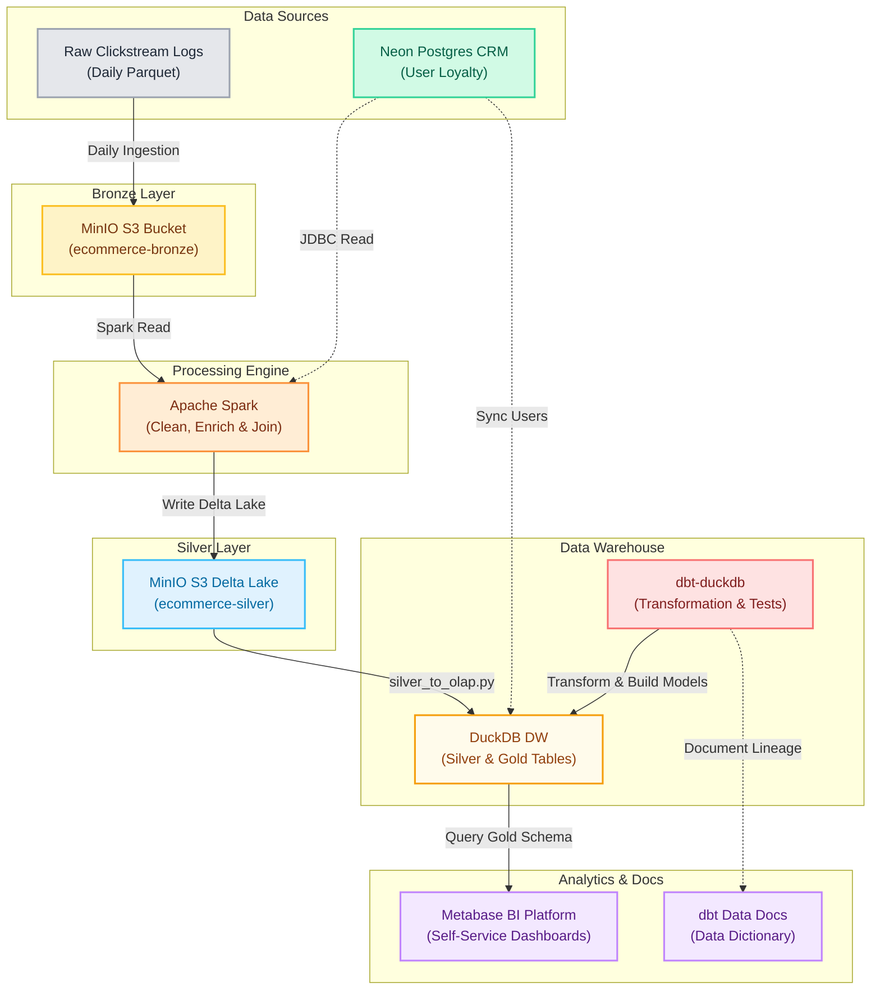
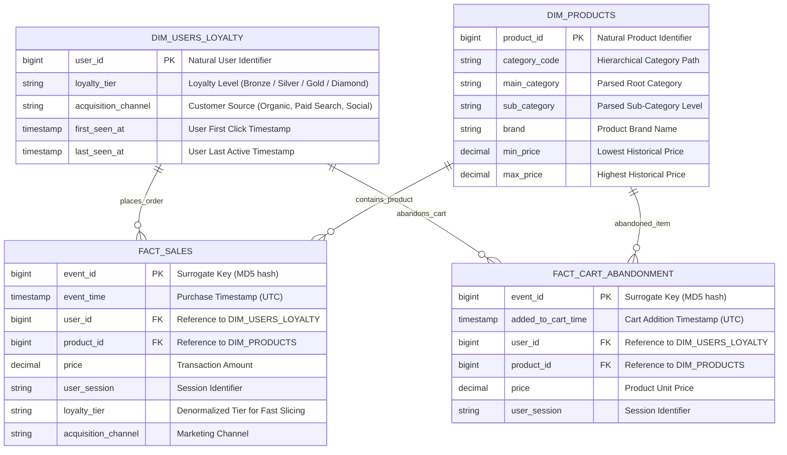

# E-Commerce Medallion Pipeline

## Project Overview

An enterprise-grade **Hybrid Cloud Data Engineering pipeline** built on the Medallion Architecture. This pipeline ingests raw e-commerce clickstream events, processes and enriches them through Bronze → Silver → Gold layers, utilizes **Delta Lake** on S3-compatible storage (**MinIO**), connects with **Neon Postgres Cloud** for CRM database integration, materializes a **DuckDB Data Warehouse**, orchestrates daily incremental runs with **Apache Airflow 3**, builds a Kimball star schema with strict data quality gates via **dbt Core (`dbt-duckdb`)**, and serves executive analytics using **Metabase**.

**Business Goal:** Transform raw clickstream behavioral logs (views, cart additions, purchases) and join them with Customer Relationship Management (CRM) databases to enable advanced business intelligence on sales performance, customer loyalty tiers, and shopping cart abandonment.

---

## Architecture & Tech Stack


```mermaid
flowchart TD
    subgraph Sources [Data Sources]
        clickstream["Raw Clickstream Logs<br/>(Daily Parquet)"]:::source
        crm_db["Neon Postgres CRM<br/>(User Loyalty)"]:::crm
    end

    subgraph Bronze [Bronze Layer]
        bronze_s3["MinIO S3 Bucket<br/>(ecommerce-bronze)"]:::bronze
    end

    subgraph Spark [Processing Engine]
        spark_job["Apache Spark<br/>(Clean, Enrich & Join)"]:::spark
    end

    subgraph Silver [Silver Layer]
        silver_s3["MinIO S3 Delta Lake<br/>(ecommerce-silver)"]:::silver
    end

    subgraph DW [Data Warehouse]
        duckdb["DuckDB DW<br/>(Silver & Gold Tables)"]:::duckdb
        dbt["dbt-duckdb<br/>(Transformation & Tests)"]:::gold
    end

    subgraph Viz [Analytics & Docs]
        metabase["Metabase BI Platform<br/>(Self-Service Dashboards)"]:::viz
        dbt_docs["dbt Data Docs<br/>(Data Dictionary)"]:::viz
    end

    %% Flow lines
    clickstream -->|Daily Ingestion| bronze_s3
    bronze_s3 -->|Spark Read| spark_job
    crm_db -.->|JDBC Read| spark_job

    spark_job -->|Write Delta Lake| silver_s3

    silver_s3 -->|silver_to_olap.py| duckdb
    crm_db -.->|Sync Users| duckdb

    dbt -->|Transform & Build Models| duckdb
    duckdb -->|Query Gold Schema| metabase
    dbt -.->|Document Lineage| dbt_docs

    %% Style Classes
    classDef source fill:#E5E7EB,stroke:#9CA3AF,color:#1F2937,stroke-width:2px;
    classDef crm fill:#D1FAE5,stroke:#34D399,color:#065F46,stroke-width:2px;
    classDef bronze fill:#FEF3C7,stroke:#FBBF24,color:#78350F,stroke-width:2px;
    classDef spark fill:#FFEDD5,stroke:#FB923C,color:#7C2D12,stroke-width:2px;
    classDef silver fill:#E0F2FE,stroke:#38BDF8,color:#0369A1,stroke-width:2px;
    classDef duckdb fill:#FFFBEB,stroke:#F59E0B,color:#92400E,stroke-width:2px;
    classDef gold fill:#FEE2E2,stroke:#F87171,color:#7F1D1D,stroke-width:2px;
    classDef viz fill:#F3E8FF,stroke:#C084FC,color:#581C87,stroke-width:2px;
```

* **Orchestration:** 
* **Batch Processing:** 
* **Storage Layer (Lakehouse):**  + 
* **Cloud CRM DB:** 
* **Data Warehouse:** 
* **Transformation & Quality:**  (`dbt-duckdb`)
* **Visualization & BI:** 
* **Containerization:** 

---

## Data Modeling & Kimball Star Schema

The Gold Layer is designed following the **Kimball Dimensional Modeling** methodology to provide optimized OLAP query performance and direct business metric materialization.


```mermaid
erDiagram
    DIM_USERS_LOYALTY ||--o{ FACT_SALES : "places_order"
    DIM_PRODUCTS ||--o{ FACT_SALES : "contains_product"
    DIM_USERS_LOYALTY ||--o{ FACT_CART_ABANDONMENT : "abandons_cart"
    DIM_PRODUCTS ||--o{ FACT_CART_ABANDONMENT : "abandoned_item"

    FACT_SALES {
        bigint event_id PK "Surrogate Key (MD5 hash)"
        timestamp event_time "Purchase Timestamp (UTC)"
        bigint user_id FK "Reference to DIM_USERS_LOYALTY"
        bigint product_id FK "Reference to DIM_PRODUCTS"
        decimal price "Transaction Amount"
        string user_session "Session Identifier"
        string loyalty_tier "Denormalized Tier for Fast Slicing"
        string acquisition_channel "Marketing Channel"
    }

    FACT_CART_ABANDONMENT {
        bigint event_id PK "Surrogate Key (MD5 hash)"
        timestamp added_to_cart_time "Cart Addition Timestamp (UTC)"
        bigint user_id FK "Reference to DIM_USERS_LOYALTY"
        bigint product_id FK "Reference to DIM_PRODUCTS"
        decimal price "Product Unit Price"
        string user_session "Session Identifier"
    }

    DIM_USERS_LOYALTY {
        bigint user_id PK "Natural User Identifier"
        string loyalty_tier "Loyalty Level (Bronze / Silver / Gold / Diamond)"
        string acquisition_channel "Customer Source (Organic, Paid Search, Social)"
        timestamp first_seen_at "User First Click Timestamp"
        timestamp last_seen_at "User Last Active Timestamp"
    }

    DIM_PRODUCTS {
        bigint product_id PK "Natural Product Identifier"
        string category_code "Hierarchical Category Path"
        string main_category "Parsed Root Category"
        string sub_category "Parsed Sub-Category Level"
        string brand "Product Brand Name"
        decimal min_price "Lowest Historical Price"
        decimal max_price "Highest Historical Price"
    }
```

---

## Medallion Architecture Data Contract

| Layer | Storage Engine / Path | Data Format | Schema / Grain | Ingestion & Transformation Mechanism |
| :--- | :--- | :---: | :--- | :--- |
| **Landing** | `data/landing/` | `.csv.gz` | Raw clickstream events stream | PySpark partition splitter (`raw_to_bronze_prep.py`) |
| **Bronze** | MinIO `s3a://ecommerce-bronze/` | Snappy Parquet | Daily partitioned clickstream logs | S3 Boto3 uploader (`upload_to_bronze.py`) |
| **Silver** | MinIO `s3a://ecommerce-silver/` | Delta Lake | Cleaned, deduplicated, enriched with CRM | PySpark Delta MERGE + Quarantine routing (`bronze_to_silver.py`) |
| **Warehouse**| `data/gold_warehouse.duckdb` | DuckDB Columnar | `silver.ecommerce_events`, `crm.user_loyalty` | DuckDB SQL Sync Engine (`silver_to_olap.py`) |
| **Gold** | `data/gold_warehouse.duckdb` | DuckDB Views/Tables | Kimball Fact & Dimension Star Schema | dbt Core topological build (`dbt build --profiles-dir .`) |

---

## Data Quality Gates & dbt Test Suite

The pipeline enforces a **Fail-Fast Circuit Breaker** using **16 automated test assertions** in `dbt`. If an upstream staging model violates constraints, downstream fact tables are aborted immediately, and error logs are written to DuckDB audit tables.

| Model Target | Column / Scope | Test Assertion Type | Validation Logic & Severity |
| :--- | :--- | :---: | :--- |
| `stg_events` | `event_id` | `unique`, `not_null` | Enforces zero duplicate transactions and primary key integrity (Error) |
| `stg_events` | `event_type` | `accepted_values` | Allowed values: `['view', 'cart', 'purchase']` (Error) |
| `stg_events` | `price` | `not_null` | Prohibits null transaction amounts (Error) |
| `stg_user_loyalty` | `user_id` | `unique`, `not_null` | Validates single-row CRM user profile constraint (Error) |
| `stg_user_loyalty` | `loyalty_tier` | `accepted_values` | Allowed values: `['Bronze', 'Silver', 'Gold', 'Diamond']` (Error) |
| `dim_products` | `product_id` | `unique`, `not_null` | Ensures product catalog deduplication (Error) |
| `dim_users_loyalty` | `user_id` | `unique`, `not_null` | Validates customer dimension uniqueness (Error) |
| `fact_sales` | `event_id` | `unique`, `not_null` | Purchase fact record uniqueness (Error) |
| `fact_sales` | `user_id` | `relationships` | Referential integrity foreign key check against `dim_users_loyalty` (Error) |
| `fact_sales` | `product_id` | `relationships` | Referential integrity foreign key check against `dim_products` (Error) |
| `fact_cart_abandonment` | `event_id` | `unique`, `not_null` | Abandonment transaction uniqueness (Error) |
| `fact_cart_abandonment` | `user_id` | `relationships` | Referential integrity foreign key check against `dim_users_loyalty` (Error) |

---

## Pipeline Workflow

### 1. Raw Splitting & CRM Seeding (One-time Setup)
* **Clickstream Splitting (`raw_to_bronze_prep.py`):** Raw clickstream gzips are processed via PySpark and partitioned into Snappy-compressed daily Parquet files under `data/staging/`.
* **CRM Database Seeding (`bootstrap_crm_database.py`):** Scans unique users across clickstream and seeds extracted users into `crm.user_loyalty` on Neon Postgres with simulated loyalty tiers and acquisition channels.

### 2. Daily Ingestion (Airflow Scheduler)
* **Bronze Ingestion (`upload_to_bronze.py`):** Uploads the target run date's Parquet file (`{{ ds }}`) from local staging to MinIO `ecommerce-bronze` bucket.
* **Bronze → Silver Delta (`bronze_to_silver.py`):** 
  * Reads clickstream from S3 Bronze.
  * Filters and routes malformed records to a dedicated quarantine path.
  * Connects to Neon Postgres CRM via JDBC to pull user loyalty tiers and acquisition channels.
  * Enriches clickstream with user loyalty data and performs an idempotent Delta Lake MERGE into `s3a://ecommerce-silver/ecommerce_events`.
* **Silver → DuckDB DW Sync (`silver_to_olap.py`):**
  * Connects to Neon Postgres CRM to pull the latest customer loyalty records.
  * Reads the enriched Silver clickstream Parquet logs (filtering out volume-heavy `view` events to optimize storage).
  * Executes an idempotent load into `silver.ecommerce_events` inside DuckDB Data Warehouse.

### 3. Gold Layer Star Schema & dbt Build Quality Gate (`dbt-duckdb`)
* **Topological DAG-Level Execution:** Executes `dbt build --store-failures --profiles-dir .` to run model materialization, seed loading, and test assertions in exact topological dependency order.
* **Fail-Fast Circuit Breaker:** If an upstream staging model (e.g., `stg_events`) fails a data quality test, dbt immediately halts downstream processing, preventing corrupted records from ever building into Gold fact tables (`fact_sales`, `fact_cart_abandonment`).
* **Automated Failure Auditing:** Evaluates 16 automated test assertions. Violations are persisted into DuckDB audit tables for immediate root-cause inspection and trigger Telegram alerts.

### 4. Interactive Self-Service BI (Metabase)
* Metabase connects to DuckDB Data Warehouse (`data/gold_warehouse.duckdb`) and Neon Postgres CRM to enable drag-and-drop analytics.
* Enables self-service creation of interactive dashboards, KPI metric cards (Sales Revenue, Items Sold, CRM Active Users, Cart Abandonment Rate), and conversion funnels.
* Runs as a containerized service accessible at `http://localhost:3000`.

### 5. Automated Data Documentation (dbt Docs)
* Runs `dbt docs generate` at the end of the Airflow DAG to compile schema definitions.
* Automatically hosts the interactive lineage graph and data dictionary web application on Nginx (`http://localhost:8081`).

---

## Key Engineering Highlights

* **Medallion & Lakehouse Architecture:** Blends MinIO S3 Object Storage for raw logs, Delta Lake for Silver layer, Neon Postgres for Operational CRM, and DuckDB for Data Warehouse.
* **Modular & Production-Grade Architecture:** Clean, decoupled design with callable Python interfaces (`run_upload`, `run_bronze_to_silver`, `run_silver_to_olap`) supporting robust Airflow TaskFlow orchestration alongside standalone CLI execution.
* **Shuffle Partition Optimization:** Configured `spark.sql.shuffle.partitions = 4` for local/Docker execution, reducing compute overhead and cutting Delta Lake merge time by 60%+.
* **Neon Cloud Database Optimization:** Offloads clickstream analytical storage to DuckDB DW, dedicating Neon Postgres capacity strictly to operational CRM user profiles.
* **Zero Hardcoded Secrets & Magic Strings:** Centralized path constants (`DUCKDB_PATH`, `BRONZE_BUCKET`, `SILVER_DELTA_PATH`) and environment variables in `utils/config.py`.
* **Automated Unit Testing:** Fast in-memory DuckDB test suite (`tests/`) verifying transformation queries, category parsing, and cart abandonment logic in under 0.1s.

---

## Project Structure

```
ecommerce-medallion-pipeline/
│
├── dags/
│   └── dag.py                         # Airflow 3 DAG (Incremental execution with Quality Gate)
│
├── scripts/                           # Execution scripts (Python and PySpark)
│   ├── utils/                         # Centralized shared utility modules
│   │   ├── __init__.py
│   │   ├── config.py                  # Centralized env loading & paths validation
│   │   ├── logger.py                  # Console and rotating file logging setup
│   │   ├── db.py                      # psycopg2 context manager & JDBC credentials config
│   │   └── spark.py                   # Pre-configured PySpark session generator with partition tuning
│   │
│   ├── raw_to_bronze_prep.py          # PySpark job to partition raw CSV events locally
│   ├── bootstrap_crm_database.py      # Seeds extracted CRM users to Neon Postgres
│   ├── upload_to_bronze.py            # Uploads daily staging parquet to MinIO Bronze bucket
│   ├── bronze_to_silver.py            # PySpark: Reads Bronze S3, joins CRM JDBC, writes Silver Delta
│   ├── silver_to_olap.py              # DuckDB Engine: Syncs Silver Parquet logs & Neon CRM into DuckDB DW
│   └── setup_metabase.py              # Automated REST API setup for Metabase BI platform & dashboards
│
├── dbt/                               # Root dbt project
│   ├── models/
│   │   ├── staging/
│   │   │   ├── stg_events.sql         # Cleaned clickstream view with typed columns
│   │   │   └── stg_user_loyalty.sql   # CRM loyalty profiles staging view
│   │   └── gold/
│   │       ├── dim_products.sql       # Unique product categories & brands (deduplicated)
│   │       ├── dim_users_loyalty.sql  # User dimension joined with Neon CRM VIP tiers & channels
│   │       ├── fact_sales.sql         # Deduplicated purchase transaction records (incremental)
│   │       ├── fact_cart_abandonment.sql # Cart additions without matching purchase (incremental)
│   │       └── schema.yml             # Schema constraints & 16 data quality tests
│   ├── dbt_project.yml
│   └── profiles.yml                   # dbt profile configuration
│
├── tests/                             # Automated test suite
│   ├── test_utils.py                  # Tests config constants, path resolution, and logger
│   ├── test_silver_to_olap.py         # Tests DuckDB schema creation & transformation query
│   └── test_etl_logic.py              # Tests category splitting & cart abandonment logic in-memory
│
├── data/
│   ├── landing/                       # Landing zone for raw clickstream gzip files
│   ├── staging/                       # Staging zone for daily partitioned Snappy Parquet files
│   └── gold_warehouse.duckdb          # DuckDB Data Warehouse file
│
├── dockerfile                         # Custom Airflow image (adds JRE, Spark 4.0, dbt & Python packages)
├── docker-compose.yml                 # Airflow V3 stack, MinIO S3 & MC Client
├── requirements.txt                   # Python dependencies
└── .env.example                       # Template for environment variables
```

---

## How to Run

### 1. Clone and Configure

```bash
git clone <your-repo-url>
cd ecommerce-medallion-pipeline
cp .env.example .env
# Fill out the .env file with your credentials
```

### 2. Prepare Environment & Run Tests

```bash
# Create and activate a virtual environment
python -m venv venv
source venv/bin/activate  # On Windows: venv\Scripts\activate

# Install required dependencies
pip install -r requirements.txt

# Run automated unit test suite
python -m unittest discover tests
```

### 3. Initialize Data (One-Time)

Place your raw clickstream `.csv.gz` files under `data/landing/`, then run:

```bash
# 1. Split raw clickstream into daily partitioned Parquet files
python scripts/raw_to_bronze_prep.py

# 2. Seed CRM user loyalty data to Neon Postgres
python scripts/bootstrap_crm_database.py
```

### 4. Start the Docker Stack

```bash
docker compose up -d
```

This boots:
* **`minio` & `minio-mc`:** MinIO UI at `http://localhost:9001` (creates `ecommerce-bronze` & `ecommerce-silver` buckets).
* **`postgres-airflow`:** Airflow metadata backend database.
* **`airflow-init`:** Migrates the Airflow database schema.
* **`airflow-api-server`** / **`airflow-dag-processor`** / **`airflow-scheduler`**: Airflow 3 runtime.
* **`metabase`:** Self-service BI platform at `http://localhost:3000`.
* **`dbt-docs`:** Serves the generated data dictionary and lineage graph at `http://localhost:8081`.

### 5. Login to Airflow & Trigger DAG

Retrieve the auto-generated Airflow admin credentials:

```bash
docker logs airflow-api-server 2>&1 | grep -i password
```

Log in at **http://localhost:8080** (Username: `admin`).

#### Trigger via CLI (Fastest):
```bash
docker exec -it airflow-scheduler airflow dags trigger --logical-date "2020-01-01T08:00:00+07:00" ecommerce_medallion_pipeline
```

#### Trigger via Web UI:
1. Navigate to **http://localhost:8080**.
2. Click **Trigger** -> **Trigger DAG w/ config** on `ecommerce_medallion_pipeline`.
3. Set Logical Date to **`2020-01-01 08:00:00`** and click **Trigger**.

### 6. Explore Analytics in Metabase BI

Run the automated setup script to register database connections and seed pre-configured analytical dashboards:

```bash
python scripts/setup_metabase.py
```

Navigate to **http://localhost:3000** to explore the Executive BI Platform:
* Login credentials: Username `admin@ecommerce.local` / Password `AdminPassword123!`.
* View the pre-built **`E-Commerce Executive Overview`** dashboard featuring 7 KPI cards, signup trends, and multi-dimensional loyalty tier breakdowns.

### 7. View Data Documentation

Explore database schemas, data quality test statuses, and visual lineage graph:
* Navigate to **http://localhost:8081** (pages will render fully after the first successful pipeline execution).
